# AuraPDF — AI-Powered Universal Document Reader & Converter
> **Note:** This document combines the project overview, developer documentation, and deployment guides into a single comprehensive reference.

## 1. Project Overview


AuraPDF is a **premium dark-mode PDF converter** and **universal document reader** with integrated AI capabilities. It converts searchable PDFs to dark mode while preserving text layers, supports EPUB and Markdown reading, provides multi-provider AI chat with RAG, and features a rich, interactive frontend.

### Core Capabilities

| Capability | Description |
|---|---|
| **PDF to Dark Mode** | Converts light PDFs to dark mode using YCbCr color-space manipulation |
| **Smart Invert** | Preserves embedded images/diagrams while inverting text and backgrounds |
| **Custom Themes** | 4 built-in presets + fully customizable RGB background/text colors |
| **Live Preview** | Real-time server-side rendering of any page with current settings |
| **Parallel Processing** | Multi-threaded page compilation via ThreadPoolExecutor |
| **AI Reader** | Full document reader with AI chat, TTS, highlights, and notes |
| **Multi-Provider AI** | OpenAI, Anthropic, Gemini, Ollama, LM Studio via unified adapter |
| **RAG** | ChromaDB + sentence-transformers for context-aware document QA |
| **User Accounts** | JWT auth, conversion history, saved custom themes |

---

## 2. Quick Start: Local Development


Follow these steps to quickly get the backend running locally. Note: All imports are relative to the root project folder, so you **must** run the server from the root directory.

### Step 0: Fork and Clone the Repository
If you are contributing, first fork the repository on GitHub. Then clone your fork locally:
```bash
git clone https://github.com/<your-username>/app-agentic.git
cd app-agentic
```

### Step 1: Create a Virtual Environment (Recommended)
```bash
python -m venv venv

# On Windows:
venv\Scripts\activate
# On Mac/Linux:
source venv/bin/activate
```

### Step 2: Install Dependencies
```bash
pip install -r requirements.txt
```

### Step 3: Set Up Configuration
The repository includes an `.env.example` file. You must copy it to create your local `.env` configuration file:
```bash
# On Windows
copy .env.example .env

# On Mac/Linux
cp .env.example .env
```
*(Optional)* Open `.env` and add any API keys you wish to use (e.g., OpenAI, Anthropic), or leave them blank to configure them later in the UI.

### Step 4: Run the FastAPI Server
Do not `cd` into the `src` folder. Run the application as a module from the root of the project:
```bash
python -m uvicorn src.main:app --port 8080 --reload
```
The application will be running at `http://localhost:8080`.

### Step 5 (Optional): Frontend Tooling & Tests
If you want to run the Playwright End-to-End tests or modify the UnoCSS styling, install the Node dependencies:
```bash
npm install
npm run build:css   # To compile CSS changes
npx playwright test # To run E2E tests
```

---

## 3. GCP Cloud Run Deployment Guide


Follow these steps to set up, test, and deploy the pipeline.

### Prerequisites

You will need the following tools installed on your system:
1. **Python 3.11+** ([Download here](https://www.python.org/downloads/) or install via Microsoft Store)
2. **Terraform 1.3+** ([Download here](https://developer.hashicorp.com/terraform/downloads))
3. **Google Cloud SDK (gcloud)** ([Download here](https://cloud.google.com/sdk/docs/install))
4. **Docker** (Required to build and push the Cloud Run container image; [Download here](https://www.docker.com/products/docker-desktop/))

---

### Step 1: Google Cloud SDK Initialization

1. Open PowerShell and run the login commands:
   ```powershell
   # Login to your Google Cloud Account
   gcloud auth login

   # Set Application Default Credentials (needed by Terraform)
   gcloud auth application-default login
   ```
2. Configure your project ID:
   ```powershell
   gcloud config set project YOUR_GCP_PROJECT_ID
   ```

---

### Step 2: Build & Push the Container Image

Before applying Terraform, you need to build the Docker image of the FastAPI application and push it to Google Artifact Registry (or Google Container Registry) so Cloud Run can deploy it.

1. **Create an Artifact Registry repository** (replace `us-central1` and `YOUR_GCP_PROJECT_ID` with your values):
   ```powershell
   gcloud artifacts repositories create doc-pipeline-repo `
       --repository-format=docker `
       --location=us-central1 `
       --description="Docker repository for document processing pipeline"
   ```
2. **Configure Docker to authenticate with Artifact Registry**:
   ```powershell
   gcloud auth configure-docker us-central1-docker.pkg.dev
   ```
3. **Build the container image**:
   ```powershell
   cd src
   docker build -t us-central1-docker.pkg.dev/YOUR_GCP_PROJECT_ID/doc-pipeline-repo/document-processor:latest .
   ```
4. **Push the image to Artifact Registry**:
   ```powershell
   docker push us-central1-docker.pkg.dev/YOUR_GCP_PROJECT_ID/doc-pipeline-repo/document-processor:latest
   ```
5. Navigate back to the root directory:
   ```powershell
   cd ..
   ```

---

### Step 3: Deploy with Terraform

1. Open the [terraform.tfvars](file:///c:/Users/arunk/Downloads/projects/day%201%20first%20project%20serverless/terraform/terraform.tfvars) file and update:
   - `project_id` to your actual Google Cloud Project ID.
   - `container_image_url` to the URL of the pushed image (e.g., `us-central1-docker.pkg.dev/YOUR_GCP_PROJECT_ID/doc-pipeline-repo/document-processor:latest`).
2. Navigate to the `terraform` directory:
   ```powershell
   cd terraform
   ```
3. Initialize Terraform:
   ```powershell
   terraform init
   ```
4. Preview the changes:
   ```powershell
   terraform plan
   ```
5. Apply the configuration (type `yes` to confirm):
   ```powershell
   terraform apply
   ```
   *Note: On deployment, Terraform will output your GCS Bucket Name, Cloud Run URL, and BigQuery Table ID.*

---

### Step 4: Verification & Testing

Once deployed, you can verify that the pipeline is working.

1. **Upload a document** to your GCS bucket:
   ```powershell
   # Use the bucket name output by Terraform
   gcloud storage cp ..\tests\test_main.py gs://gcs-ocr-ingestion-YOUR_GCP_PROJECT_ID/invoice_2026_test.pdf
   ```
2. **Check Cloud Run Logs**:
   - Go to the Google Cloud Console.
   - Navigate to **Cloud Run** -> **document-processor**.
   - Click on **Logs** to view the Pub/Sub request payload and verify the simulated OCR processing.
3. **Query BigQuery**:
   - Go to the GCP Console and open **BigQuery**.
   - Query the `processed_metadata` table to view the written row:
     ```sql
     SELECT * FROM `YOUR_GCP_PROJECT_ID.document_pipeline.processed_metadata` LIMIT 10;
     ```

---

## 4. System Architecture


### 2.1 High-Level Architecture Diagram

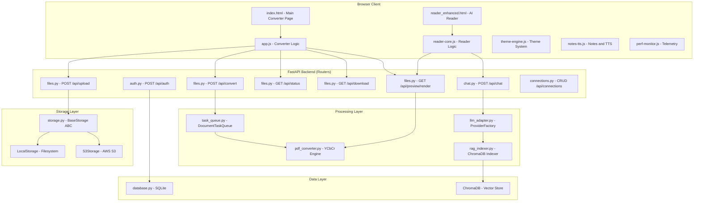

### 2.2 PDF Conversion Data Flow

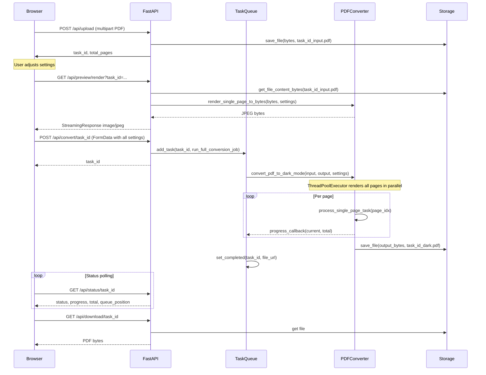

### 2.3 Multi-Provider AI Chat Flow

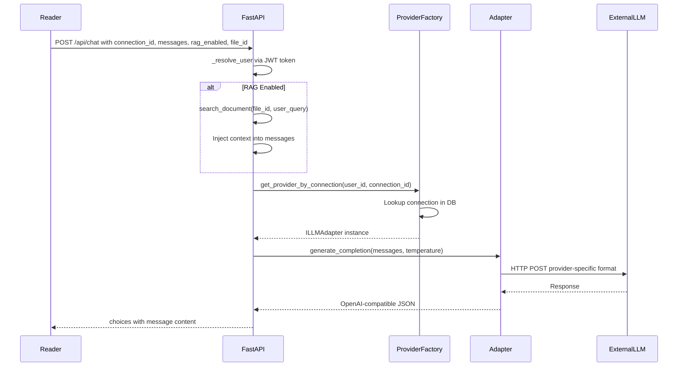

---

## 5. Directory Structure


```
project-root/
+-- src/
|   +-- main.py                    # FastAPI entrypoint, mounts routers (~80 lines)
|   +-- config.py                  # Pydantic Settings
|   +-- dependencies.py            # FastAPI Dependencies
|   +-- routers/                   # Modular API endpoints
|       +-- auth.py
|       +-- chat.py
|       +-- connections.py
|       +-- files.py
|       +-- themes.py
|   +-- pdf_converter.py           # Core YCbCr dark-mode engine (~331 lines)
|   +-- storage.py                 # Abstract storage Local / S3 (~147 lines)
|   +-- task_queue.py              # Async background job queue (~130 lines)
|   +-- database.py                # SQLite Repository Pattern (~300 lines)
|   +-- llm_adapter.py             # Multi-provider LLM adapters async httpx (~184 lines)
|   +-- rag_indexer.py             # ChromaDB RAG indexer (~100 lines)
|   +-- requirements.txt           # Python dependencies
|   +-- Dockerfile                 # Container build spec
|   +-- database.db                # SQLite database file
|   +-- chroma_db/                 # ChromaDB persistent storage
|   +-- temp/                      # Temporary file workspace
|   +-- static/
|       +-- index.html             # Main converter page
|       +-- app.js                 # Main page JavaScript logic (~642 lines)
|       +-- style.css              # Global CSS styles (~18K)
|       +-- reader.html            # Basic reader
|       +-- reader_enhanced.html   # Enhanced AI Reader (~53K)
|       +-- css/                   # Additional CSS
|       +-- js/
|           +-- reader-core.js     # Core reader logic (~43K)
|           +-- pdf-handler.js     # PDF.js integration (~63K)
|           +-- epub-handler.js    # EPUB parsing and rendering (~6.8K)
|           +-- markdown-handler.js # Markdown rendering (~4.8K)
|           +-- theme-engine.js    # Reader theme system (~17K)
|           +-- font-engine.js     # Custom font loading (~2.1K)
|           +-- notes-tts.js       # Highlights, notes, TTS (~27K)
|           +-- reading-experience.js # Reading progress (~1.1K)
|           +-- perf-monitor.js    # Performance telemetry (~12K)
+-- tests/
|   +-- e2e/
|       +-- main.spec.js           # Playwright: converter page tests
|       +-- chat.spec.js           # Playwright: chat UI tests
+-- terraform/                     # GCP infrastructure-as-code
+-- package.json                   # Node.js dev dependencies (Playwright)
+-- README.md
```

---

## 6. Technology Stack


| Layer | Technology | Purpose |
|---|---|---|
| **Backend** | Python 3.11, FastAPI | REST API server |
| **PDF Engine** | PyMuPDF (fitz), Pillow | Page rendering, color manipulation |
| **Database** | SQLite3 | Users, themes, history, connections |
| **Vector DB** | ChromaDB | RAG embeddings storage |
| **Embeddings** | sentence-transformers (all-MiniLM-L6-v2) | Text chunk embedding |
| **Auth** | HMAC-SHA256 JWT (custom), bcrypt | Token-based authentication |
| **Credential Encryption** | AES-256-GCM (AESGCM) | Encrypt stored API keys |
| **Cloud Storage** | AWS S3 (boto3) | Optional cloud file storage |
| **Cloud Analytics** | Google BigQuery | Document metadata pipeline |
| **AI Providers** | OpenAI, Anthropic, Gemini, Ollama, LM Studio | Multi-provider LLM support |
| **Frontend** | Vanilla HTML/CSS/JS | No framework dependencies |
| **Testing** | Playwright | E2E browser automation tests |
| **Deployment** | Docker, Terraform, GCP Cloud Run | Container orchestration |

---

## 7. Backend Modules


### 5.1 main.py — FastAPI Application

**File:** `src/main.py` (~80 lines)
**Role:** Application entry point. Mounts modular routers and lifecycle hooks.

#### Lifespan Hooks

```python
@asynccontextmanager
async def lifespan(app: FastAPI):
    init_db()                                    # Create SQLite tables
    await task_queue.start()                     # Start 2 background workers
    asyncio.create_task(periodic_temp_cleanup()) # Cleanup every 30 min
    async with httpx.AsyncClient() as client:
        _http_client = client                    # Shared HTTP client
        yield
    await task_queue.stop()
```

#### Key Responsibilities

| Responsibility | Route Pattern | Method |
|---|---|---|
| Serve HTML pages | `/`, `/reader`, `/reader-enhanced` | GET |
| File upload | `/api/upload` | POST |
| Trigger conversion | `/api/convert/{task_id}` | POST |
| Live preview | `/api/preview/render` | GET |
| Conversion status | `/api/status/{task_id}` | GET |
| Download result | `/api/download/{task_id}`, `/api/download-file/{task_id}` | GET |
| User auth | `/api/auth/register`, `/api/auth/login` | POST |
| History | `/api/history` | GET |
| Saved themes | `/api/themes` | GET, POST |
| AI connections CRUD | `/api/connections` | GET, POST, PUT, DELETE |
| AI chat | `/api/chat` | POST |
| Local LLM chat | `/api/local_chat` | POST |
| LLM proxy | `/api/proxy_llm`, `/api/proxy/chat` | POST |
| OpenAI-compat | `/v1/chat/completions` | POST |
| Health check | `/health` | GET |
| Pub/Sub pipeline | `/pubsub` | POST |

#### Temp File Cleanup

A background coroutine runs every 30 minutes and deletes any file in `src/temp/` older than 1 hour:

```python
async def periodic_temp_cleanup():
    while True:
        now = time.time()
        for filename in os.listdir(LOCAL_TEMP_DIR):
            filepath = os.path.join(LOCAL_TEMP_DIR, filename)
            if os.stat(filepath).st_mtime < now - 3600:
                os.remove(filepath)
        await asyncio.sleep(1800)
```

---

### 5.2 pdf_converter.py — Image Processing Engine

**File:** `src/pdf_converter.py` (~331 lines)  
**Role:** The core dark-mode conversion engine. Uses a YCbCr color-space manipulation strategy.

#### Algorithm: YCbCr Look-Up Table Mapping

The engine converts images to YCbCr color space and applies per-channel look-up tables (LUTs) to remap luminance, chrominance-blue, and chrominance-red independently.

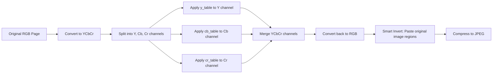

#### Functions

| Function | Purpose |
|---|---|
| `rgb_to_ycbcr_scalar(r, g, b)` | Converts RGB integers to YCbCr scalars for custom themes |
| `compute_color_tables(color_mode, brightness, ...)` | Returns 3 LUTs (y_table, cb_table, cr_table) based on theme preset or custom RGB |
| `process_single_page_task(input_path, page_idx, ...)` | Worker function that processes one page. Opened independently per thread. |
| `convert_pdf_to_dark_mode(input, output, ...)` | Main entry: orchestrates parallel multi-page conversion via ThreadPoolExecutor |
| `render_single_page_to_bytes(input, page_num, ...)` | Renders a single page preview to JPEG bytes for the live preview API |

#### Color Table Computation (Strategy Pattern)

```python
def compute_color_tables(color_mode, brightness_factor, custom_bg_rgb=None, 
                         custom_text_rgb=None, custom_sat_factor=None):
    # Each preset defines: target_min (dark bg Y), target_max (text Y), 
    #                       sat_factor, cb_tint, cr_tint
    
    if color_mode == "comfort":     # Warm dark, slightly desaturated
        target_min, target_max, sat_factor = 25, 225, 0.8
    elif color_mode == "deep_space": # True dark, high contrast
        target_min, target_max, sat_factor = 0, 225, 0.85
    elif color_mode == "monochrome": # Grayscale
        target_min, target_max, sat_factor = 0, 255, 0.0
    elif color_mode == "custom":     # User-defined RGB
        # Convert RGB to YCbCr scalars to extract Y targets and chroma tints
        bg_y, bg_cb, bg_cr = rgb_to_ycbcr_scalar(*custom_bg_rgb)
        text_y, text_cb, text_cr = rgb_to_ycbcr_scalar(*custom_text_rgb)
        target_min, target_max = bg_y, text_y
        cb_tint, cr_tint = bg_cb - 128, bg_cr - 128
    else:  # "classic" — pure inversion
        target_min, target_max, sat_factor = 0, 255, 1.0

    # Build Y look-up table (luminance inversion + brightness gamma)
    for i in range(256):
        val = target_min + (target_max - target_min) * (1.0 - i / 255.0)
        if brightness_factor != 1.0 and i < 200:
            val = (val/255.0) ** (1.0/brightness_factor) * 255.0
        y_table.append(clamp(val))
    
    # Build Cb/Cr tables (saturation scaling + chroma tinting)
    cb_table = [clamp(128 + (i-128)*sat_factor + cb_tint) for i in range(256)]
    cr_table = [clamp(128 + (i-128)*sat_factor + cr_tint) for i in range(256)]
```

#### Smart Invert Algorithm

After YCbCr inversion, embedded images/diagrams are restored by pasting the original pixels back:

```python
if smart_invert:
    image_infos = page.get_image_info()  # PyMuPDF extracts image bboxes
    for bbox in image_infos:
        x0, y0, x1, y1 = bbox  # PDF coordinates (72 DPI)
        # Scale to pixel coordinates
        px0, py0 = int(x0 * dpi/72), int(y0 * dpi/72)
        px1, py1 = int(x1 * dpi/72), int(y1 * dpi/72)
        # Paste original image region over inverted image
        cropped = orig_img.crop((px0, py0, px1, py1))
        inverted_img.paste(cropped, (px0, py0))
```

#### Searchable Text Layer Preservation

After rendering the dark image, an invisible (render_mode=3) text layer is overlaid to preserve searchability and copy/paste:

```python
new_page.insert_text(
    origin, text, fontsize=size, fontname=fontname,
    render_mode=3,  # Invisible — only for PDF search/selection
    overlay=True
)
```

---

### 5.3 storage.py — Abstract Storage Layer

**File:** `src/storage.py` (~147 lines)  
**Pattern:** Strategy Pattern + Factory Pattern

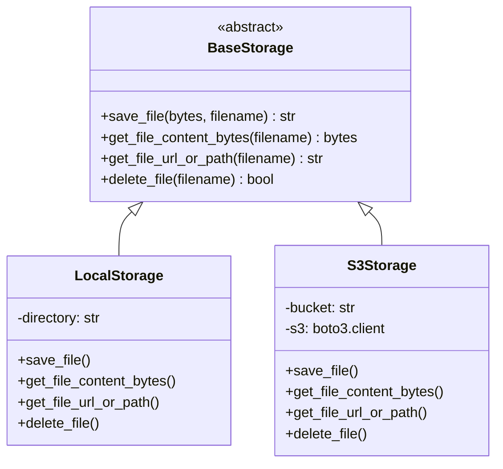

**Factory:** `get_storage()` inspects environment variables `AWS_S3_BUCKET`, `AWS_ACCESS_KEY_ID`, `AWS_SECRET_ACCESS_KEY`. If all are present and boto3 is installed, returns `S3Storage`; otherwise falls back to `LocalStorage`.

| Method | LocalStorage | S3Storage |
|---|---|---|
| `save_file` | Writes to `src/temp/{filename}` | `s3.put_object()` |
| `get_file_content_bytes` | `open(path, "rb").read()` | `s3.get_object()["Body"].read()` |
| `get_file_url_or_path` | Returns absolute filesystem path | `s3.generate_presigned_url()` (1 hour) |
| `delete_file` | `os.remove()` | `s3.delete_object()` |

---

### 5.4 task_queue.py — Background Job Queue

**File:** `src/task_queue.py` (~130 lines)  
**Pattern:** Producer-Consumer with asyncio Queue

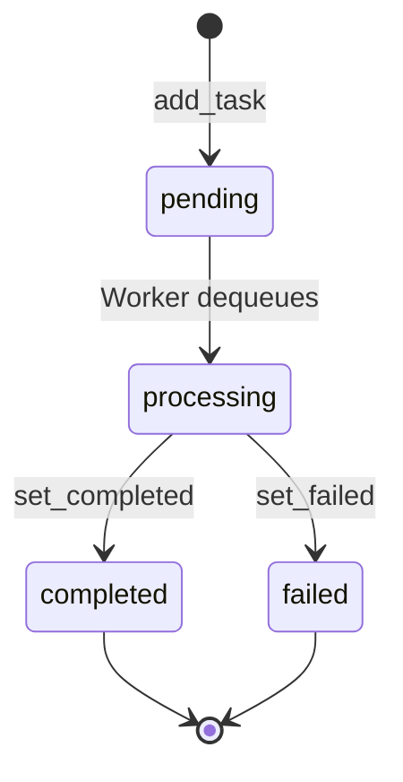

**Key Design Decisions:**

- **Concurrency:** 2 background workers (configurable via `DocumentTaskQueue(concurrency=2)`)
- **Non-blocking:** Heavy PDF conversion runs in `loop.run_in_executor(None, fn, *args)` so the FastAPI event loop stays responsive
- **Queue Position:** Clients can see their position in the queue via `/api/status/{task_id}`
- **Task Metadata:** Each task tracks `status`, `progress`, `total`, `error`, `created_at`, `started_at`, `completed_at`, `file_url`

```python
class DocumentTaskQueue:
    def add_task(self, task_id, fn, *args, **kwargs):
        self.tasks[task_id] = {"status": "pending", ...}
        self.queue.put_nowait((task_id, fn, args, kwargs))

    async def _worker_loop(self, worker_id):
        while self.running:
            task_id, fn, args, kwargs = await self.queue.get()
            self.tasks[task_id]["status"] = "processing"
            await loop.run_in_executor(None, fn, *args, **kwargs)
```

---

### 5.5 database.py — SQLite + Auth + Encrypted Credentials

**File:** `src/database.py` (~300 lines)

#### Repository Pattern

The database uses static Repository classes (`UserRepository`, `ThemeRepository`, `ConnectionRepository`, `HistoryRepository`) to encapsulate SQLite data access logic. This replaces the previous unstructured global functions.

#### Authentication

- **Password Hashing:** HMAC-SHA256 with `SECRET_KEY`
- **JWT Tokens:** Custom implementation using HMAC-SHA256 signatures, base64-encoded payload
- **Token Format:** `{base64(payload)}.{base64(signature)}`

#### API Key Encryption

All stored LLM API keys are encrypted at rest using **AES-256-GCM**:

```python
from cryptography.hazmat.primitives.ciphers.aead import AESGCM

def _encrypt_key(api_key: str) -> str:
    aesgcm = AESGCM(_derive_encryption_key())
    nonce = os.urandom(12)
    ciphertext = aesgcm.encrypt(nonce, api_key.encode(), None)
    return base64.b64encode(nonce + ciphertext).decode()
```

---

### 5.6 llm_adapter.py — Multi-Provider AI Adapters

**File:** `src/llm_adapter.py` (~184 lines)  
**Pattern:** Adapter Pattern + Factory Pattern

The LLM integration is completely asynchronous and non-blocking, utilizing `httpx.AsyncClient` passed down from the FastAPI lifespan `app.state.http_client`. This prevents the slow LLM generation processes from blocking other concurrent user requests on the ASGI server.

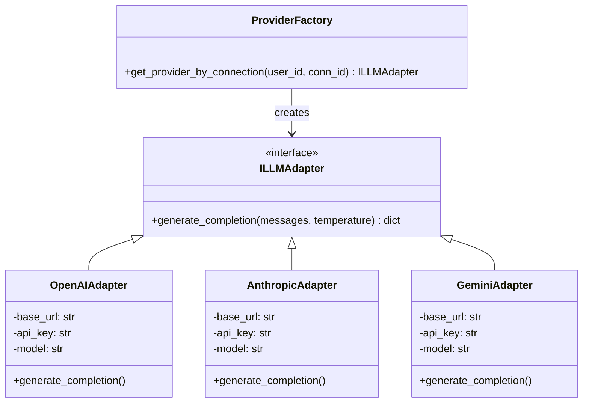

| Provider | Adapter | Notes |
|---|---|---|
| OpenAI | `OpenAIAdapter` | Standard `/chat/completions` endpoint |
| LM Studio | `OpenAIAdapter` | Uses OpenAI-compatible API |
| Ollama | `OpenAIAdapter` | Uses OpenAI-compatible API |
| Anthropic | `AnthropicAdapter` | Converts to Anthropic Messages API format |
| Gemini | `GeminiAdapter` | Converts to generateContent REST format |

**All adapters normalize output to OpenAI-compatible response format** so the frontend only needs one parser.

---

### 5.7 rag_indexer.py — RAG Vector Search

**File:** `src/rag_indexer.py` (~100 lines)

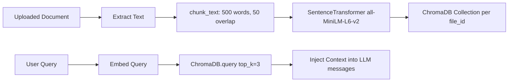

- **Chunking:** 500 words per chunk with 50-word overlap
- **Embedding Model:** `all-MiniLM-L6-v2` (384-dim vectors)
- **Storage:** ChromaDB PersistentClient at `src/chroma_db/`
- **Retrieval:** Top-3 most similar chunks injected as system context

---

## 8. Frontend Modules


### 6.1 Main Converter Page

**Files:** `src/static/index.html` + `src/static/app.js` + `src/static/style.css`

#### UI State Machine

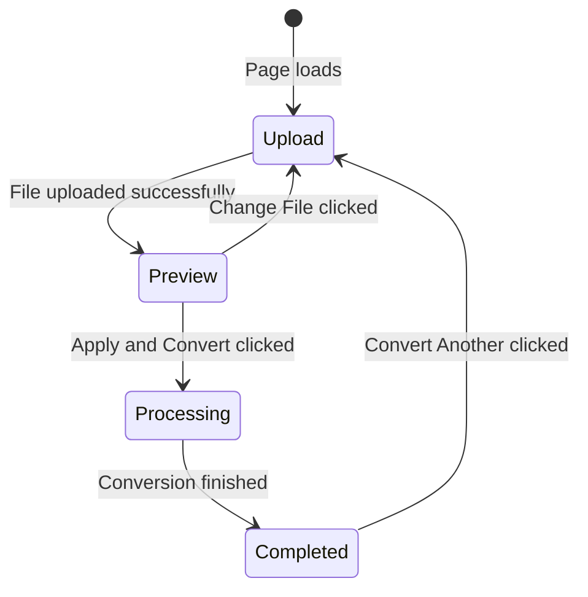

#### app.js Component Architecture

```
DOMContentLoaded
|-- DOM Element Bindings (lines 4-79)
|-- ConverterTracker telemetry plugin (lines 86-105)
|-- Slider value display listeners (lines 128-143)
|-- Theme select -> Custom panel toggle (lines 145-151)
|-- hexToRgb() helper (lines 153-161)
|-- switchView(viewName) (lines 164-185)
|-- updateLivePreview() — central preview facade (lines 188-231)
|   |-- Reads all settings from DOM
|   |-- Appends custom RGB params if theme=custom
|   |-- Fetches /api/preview/render for both original + dark
|-- Event listeners for all controls (lines 234-241)
|-- Drag-and-drop handlers (lines 243-266)
|-- handleFile(file) — upload flow (lines 279-344)
|   |-- Validates extension (pdf/epub/md)
|   |-- POSTs to /api/upload
|   |-- Redirects EPUB/MD to /reader-enhanced
|   |-- For PDFs: updates UI and calls updateLivePreview()
|-- applyAllBtn -> Full conversion flow (lines 347-430)
|   |-- Constructs FormData with all settings
|   |-- Appends custom RGB if theme=custom
|   |-- POSTs to /api/convert/{task_id}
|   |-- Starts polling /api/status/{task_id}
|-- pollProgress() — status polling loop (lines 432-480)
|-- Download and Convert Another handlers (lines 482-520)
|-- Auth UI login/register modal (lines 522-600)
|-- History dashboard refresh (lines 602-642)
```

#### Settings Grid HTML Structure

```html
<div class="settings-grid">
    <!-- Theme Preset -->
    <select id="theme-select">
        <option value="comfort">Comfort Dark</option>
        <option value="deep_space">Deep Space</option>
        <option value="monochrome">True Black</option>
        <option value="classic">Classic Invert</option>
        <option value="custom">Custom Colors</option>
    </select>

    <!-- Custom Colors Panel (hidden by default) -->
    <div id="custom-colors-panel" style="display: none;">
        <input type="color" id="custom-bg-color" value="#121212">
        <input type="color" id="custom-text-color" value="#e0e0e0">
        <input type="range" id="custom-sat-slider" min="0" max="2.0"
               step="0.1" value="1.0">
    </div>

    <!-- Smart Invert -->
    <input type="checkbox" id="smart-invert" checked>

    <!-- Text Brightness Boost -->
    <input type="range" id="brightness-slider" min="1.0" max="2.0"
           step="0.1" value="1.3">

    <!-- Resolution (DPI) -->
    <input type="range" id="dpi-slider" min="72" max="300"
           step="1" value="150">

    <!-- Image Quality -->
    <input type="range" id="quality-slider" min="50" max="100"
           step="5" value="80">

    <!-- Parallel Workers -->
    <select id="threads-select">
        <option value="1">1 Thread</option>
        <option value="2">2 Threads</option>
        <option value="4" selected>4 Threads</option>
        <option value="8">8 Threads</option>
    </select>

    <!-- Preview Page Number -->
    <input type="number" id="preview-page-input" min="1" value="10">
</div>
```

---

### 6.2 Enhanced AI Reader

**File:** `src/static/reader_enhanced.html` (~53,657 bytes)

A full-featured document reader supporting PDF, EPUB, and Markdown with:

| Feature | Implementation |
|---|---|
| PDF rendering | PDF.js via `pdf-handler.js` |
| EPUB parsing | JSZip + custom XML parser via `epub-handler.js` |
| Markdown rendering | Marked.js via `markdown-handler.js` |
| Theme system | 10+ themes with live switching via `theme-engine.js` |
| Custom fonts | Google Fonts integration via `font-engine.js` |
| Text highlights | 5 color palette, persisted in localStorage |
| Inline notes | Per-highlight annotations |
| Text-to-speech | Web Speech API via `notes-tts.js` |
| AI Chat panel | Multi-provider chat with RAG toggle |
| Connection manager | CRUD for AI provider connections |
| Reading progress | Scroll tracking via `reading-experience.js` |

### 6.3 Reader Core JS Modules

| Module | File | Lines | Purpose |
|---|---|---|---|
| Reader Core | `reader-core.js` | ~43K | Main orchestrator, layout, scroll, page navigation |
| PDF Handler | `pdf-handler.js` | ~63K | PDF.js integration, page rendering, text layer |
| EPUB Handler | `epub-handler.js` | ~6.8K | EPUB spine parsing, chapter navigation |
| Markdown Handler | `markdown-handler.js` | ~4.8K | Marked.js rendering, code highlighting |
| Theme Engine | `theme-engine.js` | ~17K | 10+ themes, CSS variable injection, brightness |
| Font Engine | `font-engine.js` | ~2.1K | Google Fonts dynamic loading |
| Notes and TTS | `notes-tts.js` | ~27K | Highlights, annotations, Web Speech API |
| Reading XP | `reading-experience.js` | ~1.1K | Scroll progress, reading time estimation |
| Perf Monitor | `perf-monitor.js` | ~12K | FPS, memory, network telemetry overlay |
| AI Chat | `ai-chat.js` | ~500 | SOLID architecture: ChatState (DAG), ChatUI, ChatAPI, ConnectionManager |

---

## 9. Feature Reference


### 7.1 PDF Dark-Mode Conversion

**What it does:** Converts a light-background searchable PDF into a dark-mode PDF while preserving the invisible text layer for search and copy/paste.

**How to reimplement:**
1. Open PDF with PyMuPDF (`fitz.open()`)
2. For each page, render to bitmap at target DPI
3. Convert bitmap to YCbCr color space
4. Apply look-up tables to invert luminance and adjust chroma
5. Optionally restore embedded image regions (Smart Invert)
6. Compress to JPEG
7. Create new PDF, insert dark image as page background
8. Overlay invisible text layer using `render_mode=3`

---

### 7.2 Theme Presets and Custom Colors

**Presets (built-in strategies):**

| Preset | target_min | target_max | sat_factor | Description |
|---|---|---|---|---|
| `comfort` | 25 | 225 | 0.8 | Warm dark, easy on eyes |
| `deep_space` | 0 | 225 | 0.85 | True black background |
| `monochrome` | 0 | 255 | 0.0 | Pure grayscale |
| `classic` | 0 | 255 | 1.0 | Simple mathematical inversion |

**Custom Colors:**
- User picks hex values for background and text via color input elements
- Frontend converts hex to RGB via `hexToRgb()` and passes as query params: `custom_bg_r`, `custom_bg_g`, `custom_bg_b`, `custom_text_r`, `custom_text_g`, `custom_text_b`
- Backend converts RGB to YCbCr scalars, derives `target_min`, `target_max`, `cb_tint`, `cr_tint`

---

### 7.3 Smart Invert

**Parameter:** `smart_invert=true/false`  
**Algorithm:** After dark-mode conversion, PyMuPDF's `page.get_image_info()` extracts bounding boxes of all embedded images. These regions are cropped from the original (non-inverted) image and pasted back over the inverted result.

**Why:** Text should be inverted (white on dark), but photos, charts, and diagrams should retain their original colors.

---

### 7.4 Text Brightness Boost

**Parameter:** `brightness` (float, 1.0 to 2.0, default 1.3)  
**Algorithm:** Applied as a gamma correction exponent on the Y (luminance) channel for input values less than 200:

```python
val = (val / 255.0) ** (1.0 / brightness_factor) * 255.0
```

Higher values make grey/light text brighter against the dark background.

---

### 7.5 Resolution DPI

**Parameter:** `dpi` (integer, 72 to 300, default 150)  
**Effect:** Controls the rendering resolution of each PDF page. Higher DPI means sharper text but larger file size. PyMuPDF's `page.get_pixmap(dpi=dpi)` uses this directly.

---

### 7.6 Image Quality

**Parameter:** `quality` (integer, 50 to 100, default 80)  
**Effect:** JPEG compression quality for each page image. `Pillow.save(format='JPEG', quality=quality)`. Lower values produce smaller files with more compression artifacts.

---

### 7.7 Parallel Workers Threads

**Parameter:** `threads` (integer, 1/2/4/8, default 4)  
**Implementation:** `ThreadPoolExecutor(max_workers=threads)`. Each page is processed independently (each worker opens the PDF file independently) enabling true parallel rendering on multi-core CPUs.

```python
with ThreadPoolExecutor(max_workers=max_workers) as executor:
    futures = {
        executor.submit(process_single_page_task, input_path, i, ...): i
        for i in range(total_pages)
    }
    for future in as_completed(futures):
        page_idx, img_bytes, text_dict, w, h = future.result()
        progress_callback(current, total)
```

---

### 7.8 Live Preview

**Endpoint:** `GET /api/preview/render?task_id=...&page_num=1&color_mode=custom&...`

The live preview renders a single page on-the-fly with the user's current settings and streams it as a JPEG. Two images are rendered simultaneously:
- `preview_type=original` — The unmodified original page
- `preview_type=dark` — The page with current dark-mode settings applied

The frontend shows these side-by-side in the Visual Conversion Preview section.

---

### 7.9 Preview Page Number

**Parameter:** `page_num` (integer, 1 to total_pages)  
**Effect:** Which page of the uploaded PDF to render in the live preview. Clamped to valid range on the backend.

---

### 7.10 User Authentication and History

**Register:** `POST /api/auth/register` creates user and returns JWT  
**Login:** `POST /api/auth/login` validates credentials and returns JWT  
**History:** Each completed conversion is logged with filename, page count, and timestamp. Displayed in a dashboard card on the main page.  
**Saved Themes:** Logged-in users can save custom theme presets (bg_color, text_color, sat_factor, brightness_factor).

---

### 7.11 Multi-Provider AI Chat

The AI Chat system is implemented via `ai-chat.js` on the frontend, using a SOLID class-based architecture to manage state and rendering:
- **`ChatState`**: Maintains a Directed Acyclic Graph (DAG) tree of chat nodes, handling complex branching and active thread resolution.
- **`ChatUI`**: Pure presentation layer handling DOM rendering, scrolling, and user input.
- **`ChatAPI`**: Handles all asynchronous `fetch` calls to `/api/chat`.
- **`ConnectionManager`**: Modal interface for CRUD operations on API keys.

Users can configure multiple AI provider connections. The system stores connection metadata and encrypted API keys. At chat time, ProviderFactory instantiates the correct adapter.

**Supported Providers:**
- OpenAI (GPT-4, GPT-3.5)
- Anthropic (Claude)
- Google Gemini
- LM Studio (local)
- Ollama (local)

**Fallback Chain (for /v1/chat/completions):**
1. Gemini API (if GEMINI_API_KEY set)
2. Local Ollama at localhost:11434
3. Error message

---

### 7.12 RAG Retrieval-Augmented Generation

When a document is uploaded, its text is extracted and indexed:

1. **PDF:** `page.get_text("text")` via PyMuPDF
2. **EPUB:** HTML stripped of tags from .xhtml files in ZIP
3. **Markdown:** Raw text content

Text is chunked (500 words, 50 overlap), embedded via all-MiniLM-L6-v2, and stored in ChromaDB. When RAG is enabled in chat, the user's query is embedded, top-3 chunks are retrieved, and injected as system context.

---

### 7.13 EPUB and Markdown Support

Non-PDF formats bypass the image conversion pipeline entirely. On upload, the file is saved to storage and marked as immediately completed. The frontend redirects to `/reader-enhanced?task_id=...`.

---

### 7.14 Text-to-Speech TTS

Implemented via the Web Speech API (SpeechSynthesisUtterance). The reader supports:
- Play/pause/stop controls
- Voice selection (system voices)
- Rate and pitch adjustment
- Auto-scroll during playback
- Highlight current sentence

---

### 7.15 Performance Monitor Telemetry

`perf-monitor.js` provides a developer overlay showing:
- FPS counter
- Memory usage (JS heap)
- Network request timing
- Plugin metrics (converter status, progress, queue position)

Plugins implement a `gather(metrics)` interface to contribute telemetry data.

---

## 7.16 Advanced Library Settings

The application features advanced settings stored safely in `window.safeStorage` that dictate storage and reading behaviors. They are enabled by default for an optimal experience:
- **Manual State Save (`aura-manual-save`)**: Bypasses the heavy 2-second background scroll-save loop. State is only saved when the user explicitly clicks the "Save State" button (or silently on the `beforeunload` event).
- **Metadata-Only Cache (`aura-meta-only-cache`)**: Instructs `StorageRepository` to skip saving massive document Blob buffers into `IndexedDB`. When a document is re-opened from the Library, the user is prompted to re-upload the original file, which instantly applies their saved metadata (scroll state).
- **Auto-Explain Markdown (`aura-md-auto-explain`)**: Attaches intelligent click listeners to `<pre><code>`, ``, and `.mermaid` elements in Markdown documents, immediately piping their context to the AI Chat via `window.askAI()` (while safely ignoring text selection).

---

## 10. API Reference


### Document Processing

| Method | Endpoint | Request | Response |
|---|---|---|---|
| POST | `/api/upload` | multipart/form-data: file | `{task_id, total_pages, ext}` |
| POST | `/api/convert/{task_id}` | form-data: dpi, quality, smart_invert, brightness, color_mode, threads, custom_bg_r/g/b, custom_text_r/g/b, custom_sat | `{task_id}` |
| GET | `/api/preview/render` | query: task_id, page_num, dpi, smart_invert, brightness, color_mode, preview_type, custom_bg_r/g/b, custom_text_r/g/b, custom_sat | image/jpeg stream |
| GET | `/api/status/{task_id}` | — | `{status, progress, total, error, queue_position, file_url}` |
| GET | `/api/download/{task_id}` | — | PDF inline (Content-Disposition: inline) |
| GET | `/api/download-file/{task_id}` | — | PDF attachment (forces download) |

### Authentication

| Method | Endpoint | Request | Response |
|---|---|---|---|
| POST | `/api/auth/register` | `{username, password}` | `{token, username}` |
| POST | `/api/auth/login` | `{username, password}` | `{token, username}` |
| GET | `/api/history` | Header: Authorization: Bearer token | `[{filename, pages_count, created_at}]` |
| POST | `/api/themes` | `{name, bg_color, text_color, sat_factor, brightness_factor}` | `{status: "saved"}` |
| GET | `/api/themes` | Header: Authorization: Bearer token | `[{name, bg_color, text_color, ...}]` |

### AI Chat

| Method | Endpoint | Request | Response |
|---|---|---|---|
| GET | `/api/providers` | — | `[{id, name, type, base_url_template, auth_type}]` |
| GET | `/api/connections` | Header: Authorization | `[{id, provider_id, name, model, is_active}]` |
| POST | `/api/connections` | `{provider_id, name, base_url, model, api_key}` | `{connection_id}` |
| PUT | `/api/connections/{id}` | `{provider_id, name, base_url, model, api_key}` | `{status}` |
| DELETE | `/api/connections/{id}` | — | `{status}` |
| POST | `/api/connections/{id}/active` | — | `{status}` |
| POST | `/api/connections/test` | `{provider_id, base_url, api_key}` | `{status, message}` |
| POST | `/api/chat` | `{connection_id, messages, temperature, rag_enabled, file_id}` | OpenAI-compat response |
| POST | `/api/local_chat` | `{local_endpoint, prompt, rag_enabled, task_id}` | `{response}` |
| POST | `/v1/chat/completions` | OpenAI-compat request | OpenAI-compat response |

---

## 11. Database Schema


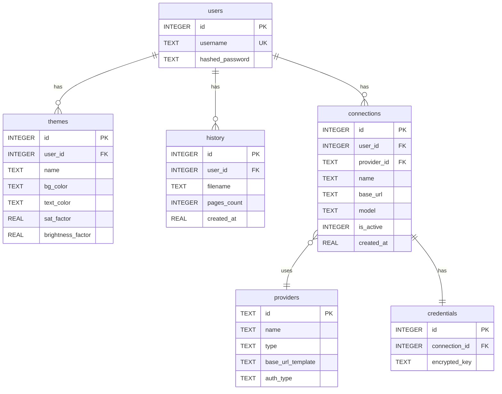

**Seed Data (providers):**

| id | name | type | base_url_template | auth_type |
|---|---|---|---|---|
| openai | OpenAI | cloud | `https://api.openai.com/v1` | bearer |
| anthropic | Anthropic | cloud | `https://api.anthropic.com/v1` | x-api-key |
| gemini | Google Gemini | cloud | `https://generativelanguage.googleapis.com/v1beta` | query_param |
| ollama | Ollama | local | `http://localhost:11434/v1` | none |
| lmstudio | LM Studio | local | `http://localhost:1234/v1` | none |

---

## 12. Design Patterns Used


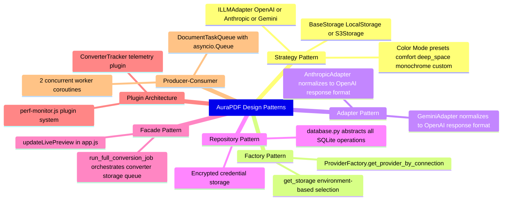

---

## 13. Testing Strategy


### E2E Tests (Playwright / Puppeteer)

**Location:** `tests/e2e/` & `test_e2e.js`

| Test File | Framework | Tests |
|---|---|---|
| `main.spec.js` | Playwright | Main page renders, theme preset toggles custom panel, sliders update, smart invert toggles, auth modal |
| `chat.spec.js` | Playwright | Chat UI renders correctly |
| `test_e2e.js` | Puppeteer | Fully automated browser test: generates dummy PDF, uploads to app, triggers scroll save, reloads page, verifies IndexedDB scroll restore |

**Run:**
```bash
npx playwright test tests/e2e
node test_e2e.js
```

### Manual Backend Verification

```python
# Upload -> Convert -> Download cycle
import requests, time
with open('test.pdf', 'rb') as f:
    r = requests.post('http://localhost:8080/api/upload', files={'file': f})
task_id = r.json()['task_id']

requests.post(f'http://localhost:8080/api/convert/{task_id}', 
    data={'color_mode': 'custom', 'custom_bg_r': 30, ...})

while True:
    s = requests.get(f'http://localhost:8080/api/status/{task_id}').json()
    if s['status'] == 'completed': break
    time.sleep(1)

pdf = requests.get(f'http://localhost:8080/api/download/{task_id}')
```

### Edge Cases to Test

- Empty PDF (0 pages)
- PDF with no text layer (image-only scans)
- PDF with complex embedded images (charts, photos)
- Very large PDFs (100+ pages, stress test parallel workers)
- Custom colors where bg_y greater than text_y (inverted Y range)
- Concurrent conversions (queue position tracking)
- S3 storage mode (pre-signed URL generation)
- JWT token expiry and renewal

---

## 13. Configuration and Environment Variables

### Proxy Security

The backend maintains a whitelist of allowed proxy hosts for the AI chat proxy endpoints:

```python
_ALLOWED_PROXY_HOSTS = frozenset({
    "api.openai.com",
    "api.anthropic.com",
    "generativelanguage.googleapis.com",
    "127.0.0.1",
    "localhost",
})
```

Any request to `/api/proxy/chat` or `/api/proxy_llm` targeting a host not in this set will receive HTTP 403.

### Environment Variables Reference

| Variable | Required | Default | Description |
|---|---|---|---|
| `GEMINI_API_KEY` | No | — | Google Gemini API key |
| `JWT_SECRET_KEY` | Recommended | Auto-generated | Secret for JWT signing |
| `AWS_S3_BUCKET` | No | — | S3 bucket for cloud storage |
| `AWS_ACCESS_KEY_ID` | No | — | AWS access key |
| `AWS_SECRET_ACCESS_KEY` | No | — | AWS secret key |
| `AWS_REGION` | No | us-east-1 | AWS region |
| `GCP_PROJECT` | No | Auto-detected | GCP project ID |
| `BIGQUERY_DATASET` | No | document_pipeline | BigQuery dataset |
| `BIGQUERY_TABLE` | No | processed_metadata | BigQuery table |
| `DEBUG_CONSOLE` | No | — | Set to 1 for verbose logging |
| `BYPASS_BIGQUERY_ERRORS` | No | — | Set to true for local dev |

---

> **End of Document.** This documentation covers every feature, algorithm, pattern, and interface in the AuraPDF codebase. A developer reading this document should be able to reimplement the entire application from scratch.

  ### 7.16 Robust Selection Engine
  
  Unlike standard browser highlighting which can glitch inside virtualized DOMs or absolute canvas layouts, AuraPDF uses a computationally enhanced **Spatial Bounding Box Engine**. During the `pdf.js` render loop, it builds an internal coordinate hash-map of all textual nodes. Selection events resolve mathematically against these bounding boxes rather than relying purely on the browser's native text selection ranges, ensuring buttery-smooth highlight drag interactions.
