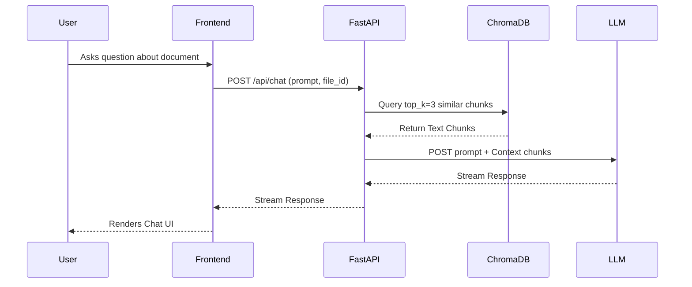

# AuraPDF Architecture

## 1. Repository Overview

AuraPDF is a powerful dark-mode PDF converter and AI-enhanced document reader. It serves end-users seeking an eye-strain-free reading experience by converting standard PDFs to customizable dark mode via YCbCr manipulation. It also operates as a comprehensive digital library, providing local IndexedDB caching, multi-provider AI Chat (OpenAI, Claude, Gemini, Local LLMs), and native Retrieval-Augmented Generation (RAG) for "chat with document" capabilities.

Because this project is built as a single monolithic repository, it handles the entire stack: serving the React-like Vanilla JS frontend, orchestrating the heavy Python/PyMuPDF background workers, managing the SQLite user database, and indexing text into a local ChromaDB vector store.

## 2. Architecture and Design

**Architectural Style:** Modular Monolith with Asynchronous Task Queues.

**Main Modules:**
*   `src/main.py`: The FastAPI application entrypoint. Maps REST routes and mounts static files.
*   `src/pdf_converter.py`: The core image processing engine. Uses `ThreadPoolExecutor` for parallelizing heavy PDF page rendering tasks to avoid blocking the main ASGI event loop.
*   `src/llm_adapter.py`: Implements the **Adapter and Factory Patterns** to unify various AI provider APIs (OpenAI, Anthropic, Gemini, Ollama) into a single standard interface.
*   `src/task_queue.py`: A lightweight producer-consumer `asyncio.Queue` system to offload file conversions.
*   `src/rag_indexer.py`: Manages the text chunking and SentenceTransformer embedding generation for the RAG pipeline.
*   `src/database.py`: Uses the **Repository Pattern** to abstract SQLite operations (Users, Themes, Chat Connections).
*   `src/static/js/`: The frontend is heavily modularized vanilla JavaScript (`reader-core.js`, `pdf-handler.js`, `ai-chat.js`).

## 3. Data and External Integrations

**Database Schema:**
*   `users`: Stores credentials (hashed).
*   `themes`: Stores custom RGB user-defined color themes.
*   `connections`: Stores user-configured AI provider profiles.
*   `credentials`: Stores AES-256-GCM encrypted API keys for the connections.
*   `history`: Tracks user conversion jobs.

**External Integrations:**
*   **LLM Providers**: Communicates asynchronously with OpenAI, Anthropic, and Google Gemini via REST APIs.
*   **ChromaDB**: Local vector database utilized for semantic search during RAG workflows.
*   **IndexedDB**: Browser-side NoSQL storage used by `StorageRepository` to cache heavy PDF blobs and reading states offline.

## 4. Key Workflows & Diagrams

### RAG Chat Workflow
When a user asks a question about the open document:
1. Frontend sends prompt + `file_id` to `/api/chat`.
2. Backend queries ChromaDB using `file_id` to retrieve top-3 relevant text chunks.
3. Backend injects chunks into the system prompt.
4. Backend streams the response back from the LLM Adapter to the client.

