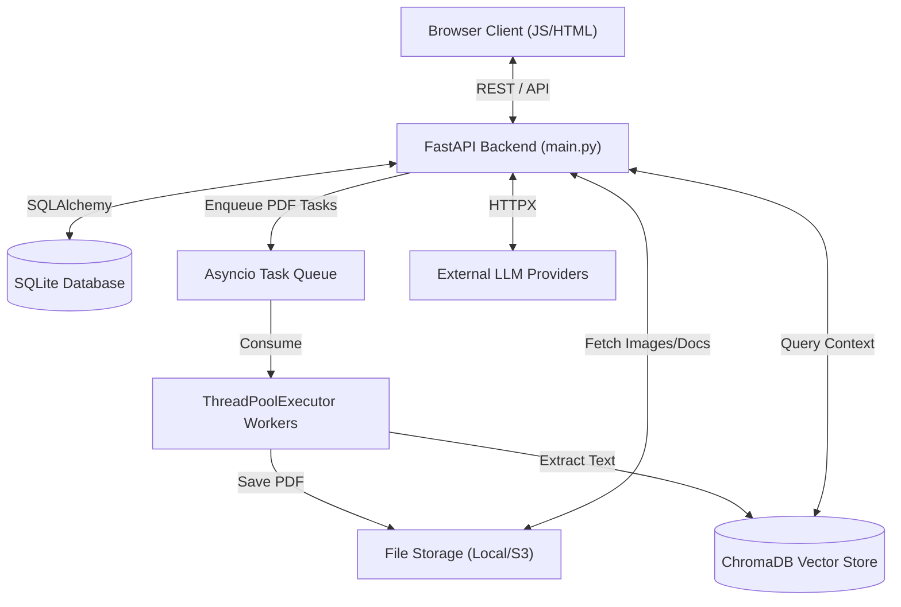

# System Overview

## 1. Overall Product Summary
AuraPDF is a powerful, AI-enhanced universal document reader and dark-mode converter. It allows users to upload standard light-mode PDFs and intelligently converts them to eye-friendly dark mode (preserving embedded images via Smart Invert). It also serves as a premium reader for EPUB and Markdown files, offering multi-provider AI chat (OpenAI, Anthropic, Gemini, Ollama), text-to-speech, custom themes, and full RAG (Retrieval-Augmented Generation) capabilities.

## 2. System Architecture

AuraPDF operates as a monolithic web application built with FastAPI and vanilla JavaScript, backed by a SQLite database and an asynchronous task queue.

## 3. Repositories Inventory

Currently, the entire project is contained within a **single monorepo**:

* **`pdf reader/` (Root Repository)**
  * **Tech Stack**: Python 3.11, FastAPI, PyMuPDF, SQLite, ChromaDB, Vanilla JS, UnoCSS.
  * **Purpose**: Houses both the backend API services (auth, file conversion, AI chat proxies, RAG integration) and the frontend SPA UI (PDF/EPUB/MD reader engines, settings UI, and chat interface).
